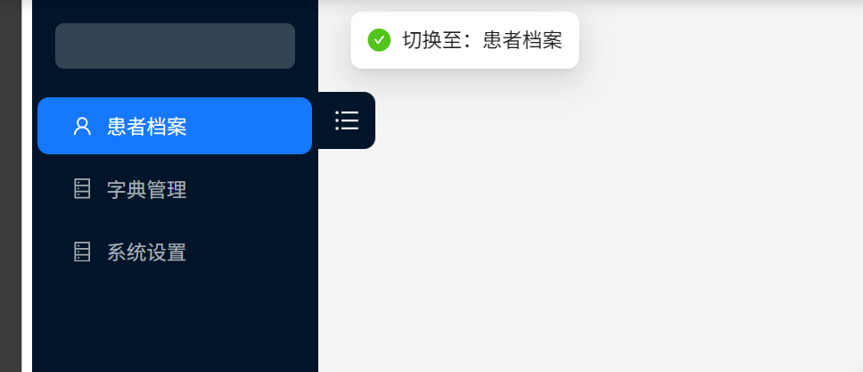
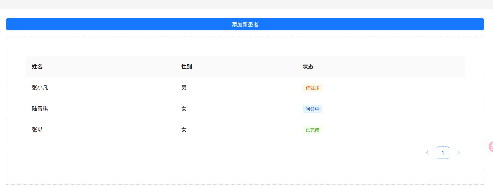

[TOC]


# 📅 GJ504b 的 React 进阶之路：Day 5
## Layout
### 1
侧边栏以及侧边栏切换逻辑
```javascript
import React, { useState } from "react";
import { Layout, Menu, Button, Flex, message, Modal, Form, Input } from "antd";
import { UserOutlined, DatabaseOutlined, SearchOutlined } from "@ant-design/icons";

const { Header, Sider, Content } = Layout;

const App = () => {
  // 1. 定义联动状态：当前选中的模块名称
  const [currentModule, setCurrentModule] = useState("字典管理");
  // const [formVisible, setFormVisible] = useState(false);
  const [messageApi, contextHolder] = message.useMessage();

  // 2. 菜单点击处理逻辑 (这是通往 RBAC 的第一步)
  const handleMenuClick = (e) => {
    const titleMap = {
      '1': '患者档案',
      '2': '字典管理',
      '3': '系统设置'
    };//翻译官

    setCurrentModule(titleMap[e.key]); // 根据 key 修改状态
    messageApi.success(`切换至：${titleMap[e.key]}`);
    
  };

  return (
    <Layout style={{ minHeight: "100vh" }}>
      {/* 这个contextHolder理论上放在哪里都可以，但是习惯上放在最外层容器上方 */}
      {contextHolder}

      {/* 侧边栏：系统的方向盘 */}
      {/* breakpoint="lg"：这是一个“触发点”。当浏览器窗口宽度小于1024px时，侧边栏会自动收起来。
          collapsedWidth="0"：配合断点使用。意思是当屏幕太小时，侧边栏缩窄到 0 像素（完全隐藏），而不是留下一个小窄条。*/}
      <Sider breakpoint="lg" collapsedWidth="0">
        
        {/* 1. 按钮上方的小个子，装饰作用 */}
        <div style={{ height: 32, margin: 16, background: 'rgba(255,255,255,.2)', borderRadius: 6 }} />

        <Menu
          theme="dark"
          mode="inline" //5. 定义菜单的展示行为 
          /*inline (内嵌模式)：专门为侧边栏设计。点击父菜单时，子菜单会在原位置向下展开
          vertical (垂直模式)：子菜单会像“悬浮窗”一样向右侧弹出。
          horizontal (水平模式)：通常用在顶部导航栏。 */

          defaultSelectedKeys={['2']}//4. 当你的系统第一次加载时，你希望哪个页面是亮起的？在这里填入对应项的 key，用户一进来就会看到这个项是蓝色高亮的。
          onClick={handleMenuClick} // 2. 绑定点击事件，绑定数据与渲染的逻辑
          items={[
            { key: '1', icon: <UserOutlined />, label: '患者档案' },
            { key: '2', icon: <DatabaseOutlined />, label: '字典管理' },
            { key: '3', icon: <DatabaseOutlined />, label: '系统设置' },
          ]}//3. items：具体的数据，便于直接添加渲染想要的数据，扩展性极强
        />
      </Sider>


     
    </Layout>
  );
};

export default App;
```





```javascript
import React, { useState } from "react";
import { Layout, Menu, Button, Flex, message, Modal, Form, Input,Table ,Tag} from "antd";
import { UserOutlined, DatabaseOutlined, SearchOutlined } from "@ant-design/icons";

const { Header, Sider, Content } = Layout;

const App = () => {
  // 1. 定义联动状态：当前选中的模块名称
  const [currentModule, setCurrentModule] = useState("患者档案");
  const [formVisible, setFormVisible] = useState(false);
  const [messageApi, contextHolder] = message.useMessage();

  // 2. 菜单点击处理逻辑 (这是通往 RBAC 的第一步)
  const handleMenuClick = (e) => {
    const titleMap = {
      '1': '患者档案',
      '2': '字典管理',
      '3': '系统设置'
    };
    
    setCurrentModule(titleMap[e.key]); // 根据 key 修改状态
    messageApi.success(`切换至：${titleMap[e.key]}`);
  };


  const data = [
    { id: '1', name: '张小凡', sex: '1', status: '0' },
    { id: '2', name: '陆雪琪', sex: '2', status: '1' },
    { id: '3', name: '张以', sex: '2', status: '2' },
  ];
// 翻译官：负责把数字代码变成人类语言
const genderMap = { '1': '男', '2': '女' };
// const statusMap = { '0': '待就诊', '1': '问诊中', '2': '已完成' };//！！ 直接解构，把我们的颜色放在statusMap里面
const statusMap = { '0': {text:'待就诊',color:'orange'}, '1': {text:'问诊中',color:'blue'}, '2': {text:'已完成',color:'green'} };
  const columns =[
    {
      title:'姓名',
      dataIndex:'name',
      key:'name',
      // 建议 key 与 dataIndex 保持一致（如 key: 'name', key: 'sex'）
    },
    {
      title:'性别',
      dataIndex:'sex',
      key:'sex',
      render:(text ) =>genderMap[text] 
      //amazing!!! 小翻译官很有用，就是要写在render里

    },
    {
      title:'状态',
      dataIndex:'status',
      key:'status',
      // render:(text) =><Tag style={
      //   text ==='0'?{color:'orange'}:text === '1'?{color:'blue'}:{color:'green'}
      // }>{statusMap[text]}</Tag>//！！ 直接解构，把我们的颜色放在statusMap里面
       
      // }>{statusMap[text]}</Tag>
      render:(text) =>{
        const config = statusMap[text] ||{text:'未知',color:'default'}
        // return<Tag style={{color:config.color}}>{config.text}</Tag>//Tag里自带的color属性
        return<Tag color={config.color}>{config.text}</Tag>

      }
    },
  ]

  return (
    <Layout style={{ minHeight: "100vh" }}>
      {contextHolder}

      {/* 侧边栏：系统的方向盘 */}
      <Sider breakpoint="lg" collapsedWidth="0">
        <div style={{ height: 32, margin: 16, background: 'rgba(255,255,255,.2)', borderRadius: 6 }} />
        <Menu
          theme="dark"
          mode="inline"
          defaultSelectedKeys={['1']}
          onClick={handleMenuClick} // 绑定点击事件
          items={[
            { key: '1', icon: <UserOutlined />, label: '患者档案' },
            { key: '2', icon: <DatabaseOutlined />, label: '字典管理' },
            { key: '3', icon: <DatabaseOutlined />, label: '系统设置' },
          ]}
        />
      </Sider>


      <Layout>
        {/* 顶部：展示当前位置 */}
        <Header style={{ background: "#fff", paddingLeft: 24, borderBottom: '1px solid #f0f0f0' }}>
          <h2 style={{ margin: 0 }}>医点就通 - {currentModule}</h2> 
        </Header>

        {/* 内容区：展示具体业务 */}
        <Content style={{ margin: "24px 16px", padding: 24, background: "#fff", borderRadius: 8 }}>
          {/* 根据不同的模块展示不同的内容（简单的条件渲染） */}
          {currentModule === "患者档案" ? (
            <Flex vertical gap="middle">
              <Button type="primary" onClick={() => setFormVisible(true)}>
                添加新患者
              </Button>
              <div style={{ padding: 50, border: '1px dashed #ccc', textAlign: 'center' }}>
                <Table columns={columns} dataSource={data} rowKey="id"></Table>
              </div>
            </Flex>
          ) : (
            <div style={{ padding: 50, textAlign: 'center' }}>
              <h3>正在加载字典管理模块...</h3>
              <p>我们将在这里实现“1=男, 2=女”的逻辑映射</p>
            </div>
          )}
        </Content>
      </Layout>

      {/* 保持并列结构的 Modal */}
      <Modal open={formVisible} footer={null} onCancel={() => setFormVisible(false)}>
        <h2>患者信息登记</h2>
        <Form layout="vertical" onFinish={(val) => {
          message.success(`录入成功：${val.username}`);
          setFormVisible(false);
        }}>
          <Form.Item label="姓名" name="username" rules={[{ required: true }]}>
            <Input />
          </Form.Item>
          <Button type="primary" htmlType="submit" block>提交</Button>
        </Form>
      </Modal>
    </Layout>
  );
};

export default App;
```
